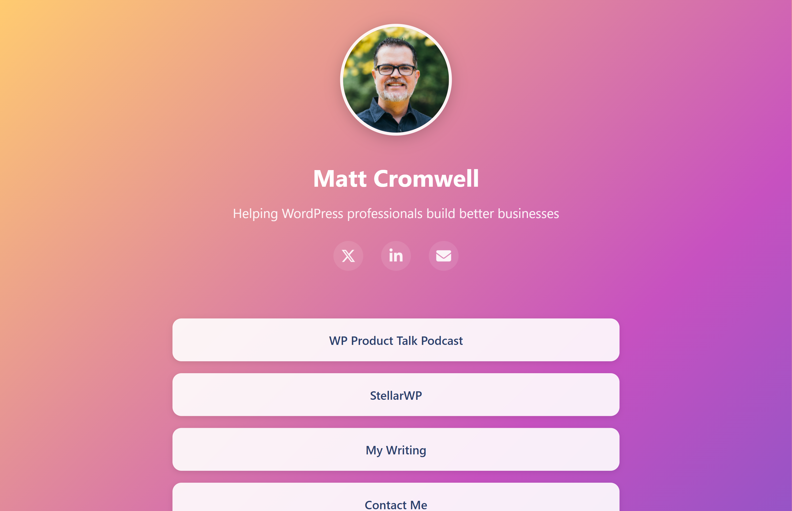

# Connect – a totally free, no-server bio site for WordPress folks ✨

Spin up a sleek "link-in-bio" page on **GitHub Pages** in minutes—no hosting bill, no complicated build chain.  
Perfect for product owners, devs, and anyone in WP-land who wants a home base that just works.



---

## Why you'll love it

* **Zero cost, zero fuss** – GitHub Pages handles the hosting and SSL.  
* **One JSON file, endless customisation** – update text, colours, and links without touching HTML.  
* **Gravatar-ready** – your profile pic is always in sync.  
* **Pulls in your latest blog posts** – drop an RSS feed in the config and you're done.  
* **Fully responsive** – looks sharp on every device.  
* **Custom domain ready** – add your own domain with a simple CNAME file.  
* **MIT-licensed** – remix it, ship it, brag about it.

---

## Quick-start (3 steps)

1. **Fork or "Use this template"**  
2. **Edit `config.json`**  
   ```json
   {
     "profile": {
       "name": "You",
       "tagline": "Build. Ship. Repeat.",
       "gravatarEmail": "you@example.com",
       "bio": "A short bio about yourself and what you do."
     },
     "social": {
       "x": "https://x.com/you",
       "linkedin": "https://linkedin.com/in/you",
       "email": "you@example.com"
     },
     "links": [
       { "title": "My Plugin", "url": "https://wordpress.org/plugins/awesome/" }
     ],
     "blog": {
       "rssFeed": "https://yourblog.com/feed/",
       "wordCount": 40
     },
     "support": {
       "buttonText": "Buy me coffee ☕",
       "url": "https://buymeacoffee.com/you"
     }
   }
   ```
3. **Enable GitHub Pages**  
   *Go to* **Settings → Pages → Source**, choose **main branch**, and save.  
   Your new site will be live at `https://<username>.github.io/`.

That's it—high-five! 🎉

---

## Make it yours

* **Switching themes** – Themes are now loaded dynamically based on a URL query parameter. To preview or share your site with a different theme, just add `?theme=bulky`, `?theme=kubrik`, `?theme=bright`, or `?theme=dark` to your URL, for example:
  
  `https://<username>.github.io/?theme=bulky`
  
  If no `theme` parameter is present, or if the value is invalid, the **dark** theme will be loaded by default.
  
  To add a new theme, simply create a new CSS file in the `styles/` folder and add its name to the theme list in `main.js`.

* **Cache-busting** – The theme and core stylesheets are automatically cache-busted on every load, so you and your visitors always get the latest version after you update your theme file.

* **Stylesheet tweaks** – Edit your theme file in the `styles/` folder for colors and effects, or edit `core.css` for layout tweaks.  
* **HTML changes** – everything lives in `index.html`. Keep it minimal or go wild.  
* **Custom domain** – add a `CNAME` file with your domain name to use your own URL.

---

## Contribute

Have a fresh colourway or nifty improvement?  
PRs that enhance the stylesheet or overall accessibility are always welcome.

---

## Feedback

Questions, ideas, or you just deployed your own?  
Open an issue or ping me on X—love hearing how people use this.

---

## License

[MIT](LICENSE) – free to use, modify, and share.

> **Note:** Replace `screenshot.png` with a real capture of **connect.mattcromwell.com** (1500×500 px works great).
